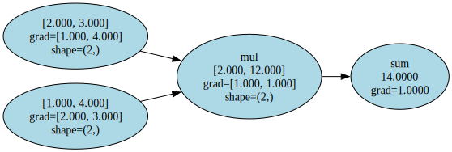
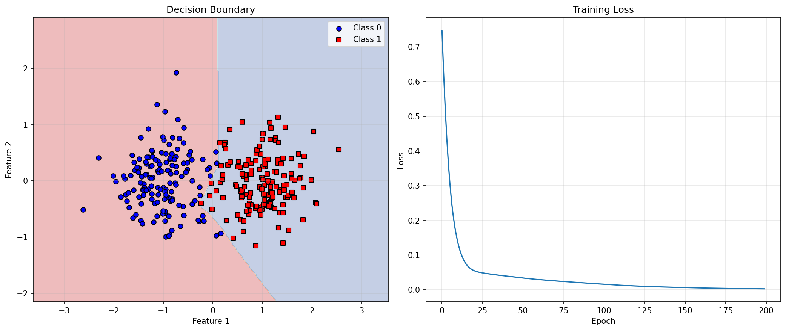
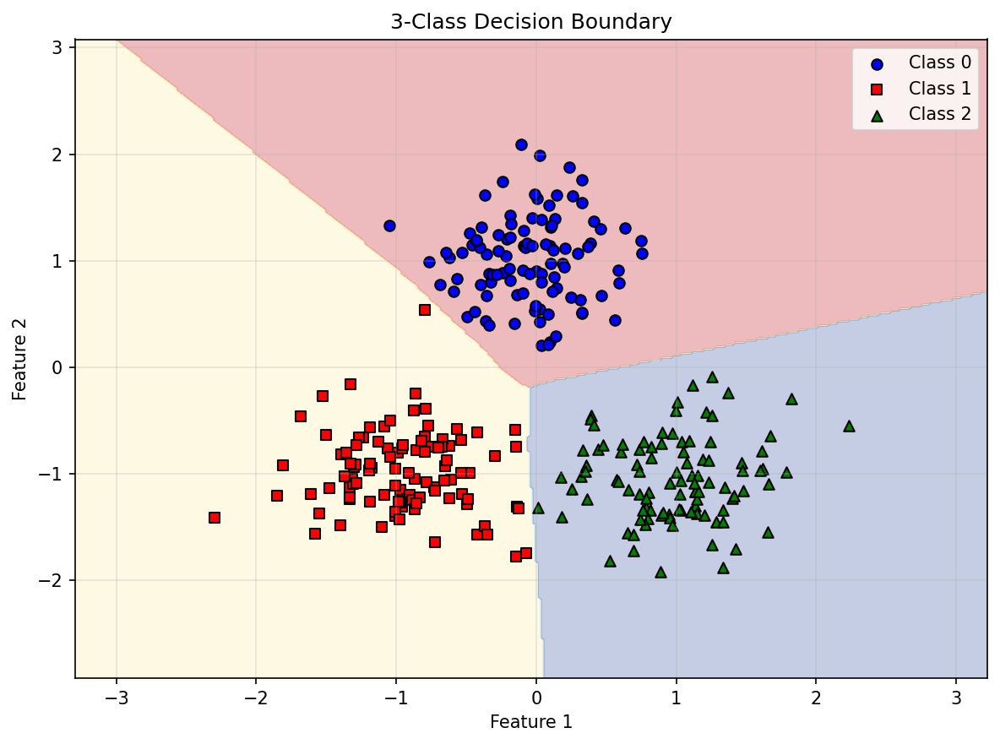

## BeaconGrad

<p align="center">
  
</p>

A tiny, fun NumPy autograd engine you can read in one sitting — **tensor-first**, with **broadcasting-aware** ops. Implements backpropagation (reverse-mode autodiff) over a dynamically built DAG and a neural networks library on top of it with a PyTorch-like API.

### What's included
- **Autograd**: `Tensor` (n‑D arrays) with reverse-mode autodiff
- **Ops**: broadcasting-aware arithmetic, matmul, reductions, activations, basic losses
- **nn**: `Module`, `Linear`, `Sequential`, `MLP`, activations, dropout, batchnorm, embedding
- **optim**: `SGD`, `Adam`, `RMSprop`, `AdaGrad`

### Install
This project uses **uv**.

```bash
uv sync
```

### Install as a package (editable)
If you want `import beacongrad` to work from anywhere (and to hack on it locally), install it in editable mode:

```bash
uv sync
uv pip install -e .
uv run python -c "import beacongrad; print(beacongrad.__version__)"
```

### Build (wheel + sdist)

```bash
uv build
```

### Quick usage

```python
import numpy as np
from beacongrad import Tensor, Sequential, Linear, ReLU, MSELoss, Adam

# Synthetic regression data
np.random.seed(0)
X = Tensor(np.random.randn(256, 10).astype(np.float32))
y = Tensor(np.random.randn(256, 1).astype(np.float32))

model = Sequential(
    Linear(10, 32),
    ReLU(),
    Linear(32, 1),
)

loss_fn = MSELoss()
opt = Adam(model.parameters(), lr=1e-2)

for epoch in range(100):
    pred = model(X)
    loss = loss_fn(pred, y)

    opt.zero_grad()
    loss.backward()
    opt.step()

    if (epoch + 1) % 10 == 0:
        print(f"epoch={epoch+1} loss={loss.item():.4f}")
```

### Run examples

```bash
uv run python examples/01_basic_tensor.py
uv run python examples/02_neural_network.py
uv run python examples/03_classification.py
uv run python examples/04_custom_model.py
uv run python examples/05_mlp.py
uv run python examples/06_visualize_graph.py
uv run python examples/07_decision_boundary.py
uv run python examples/08_gradcheck.py
uv run python examples/compare_with_pytorch.py
```

### PyTorch parity checks 
To validate BeaconGrad against PyTorch, `examples/compare_with_pytorch.py` compares **forward outputs** and **backprop gradients** against PyTorch using `torch.float64`.

If you don't have PyTorch installed in the uv environment:

```bash
uv pip install torch
```

Then run:

```bash
uv run python examples/compare_with_pytorch.py
```

#### Results (reported by `examples/compare_with_pytorch.py`)

```
============================================================
BeaconGrad vs PyTorch parity checks (float64)
============================================================

Linear parity
  forward max error: 0.000e+00
  dx max error:      0.000e+00
  dW max error:      2.220e-16
  db max error:      0.000e+00

MLP (2-layer) parity
  forward max error: 0.000e+00
  grad max error:    3.553e-15

#### Summary

| Model  | Forward max error | Grad max error |
|--------|------------------:|---------------:|
| Linear | `0.000e+00`       | `2.220e-16`    |
| MLP    | `0.000e+00`       | `3.553e-15`    |
```

### Computation Graph Visualization

BeaconGrad includes utilities to visualize computation graphs using Graphviz. This is useful for understanding how gradients flow through your computation:

```python
from beacongrad import Tensor
from beacongrad.viz import draw_dot

a = Tensor([2.0, 3.0], requires_grad=True)
b = Tensor([1.0, 4.0], requires_grad=True)
c = a * b
d = c.sum()
d.backward()

# Visualize the computation graph
graph = draw_dot(d)
graph.render("assets/example_06_graph_simple", format="svg")  # Saves into assets/
```

The graph shows:
- **Data values** (left number in each node)
- **Gradients** (right number, after backward pass)
- **Operations** (labels on nodes)
- **Shape information** for tensors



### Training a Neural Network

The example `examples/07_decision_boundary.py` demonstrates training a 2-layer MLP binary classifier on synthetic 2D data. Using a 2-layer neural net with two 16-node hidden layers, we achieve the following decision boundary:



The visualization shows:
- **Decision boundary** learned by the network
- **Training data** with different classes
- **Training loss** over epochs

For multi-class classification:



### Limitations

BeaconGrad prioritizes clarity and correctness over performance; operations are NumPy-based and not optimized for large-scale training.

### Notes
- `graphviz` and `matplotlib` are included as dependencies for visualization capabilities.
- Mascot: [OpenMoji "Lighthouse of Alexandria" (E212)](https://openmoji.org/library/emoji-E212/) (CC BY-SA 4.0).
